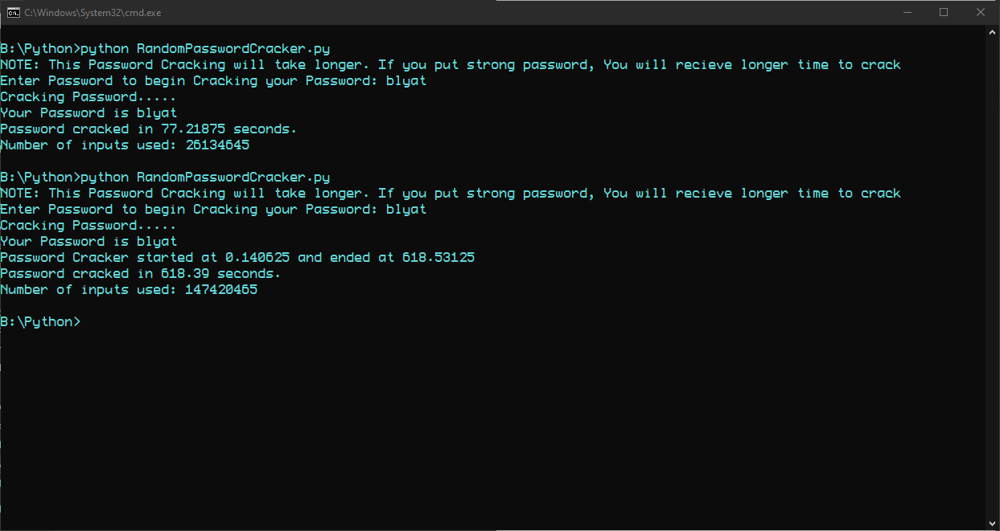

# Random Password Cracker
This project cracks created password in Brute Force method.

# Table of Contents
1. Introduction
2. Features
3. Installation
4. Usage
5. Contribution
6. License
7. Acknowledgement
8. Warning

## Introduction
The Random Password Cracker is a Python-based tool designed to demonstrate the process of cracking random passwords using brute force methods. This project is intended for educational purposes to understand the vulnerabilities of weak passwords and the importance of strong password practices.

## Features
- Brute force password cracking
- Customizable character sets
- Adjustable password length
- Real-time progress display

## Installation
1. Clone the repository:
    ```bash
    git clone https://github.com/Sudharshank-cpu/Random-Password-Cracker.git
    ```
2. Navigate to the project directory:
    ```bash
    cd Random-Password-Cracker
    ```

## Usage
1. To run the Random Password Cracker, use the following command:
    ```bash
    python RandomPasswordCracker.py
    ```
2. You can customize the character set and password length by modifying the script parameters.
3. To close this during process, Press <code>Ctrl + C</code> to Interrupt and Exit from process.

## Contribution
- Contributions are welcome! Please fork the repository and create a pull request with your changes.
- Ensure your code follows the project’s coding standards and includes appropriate tests.

## License
This project is licensed under the MIT License. See the LICENSE file for more details.

## Acknowledgements
Inspired by various password cracking tools and educational resources on cybersecurity.

## Warning
- I made only for informational sharing.
- Use my code. But, Don't Abuse it.

## Screenshot
By using only from string.ascii_lowercase at pwd(as Password Directory)


